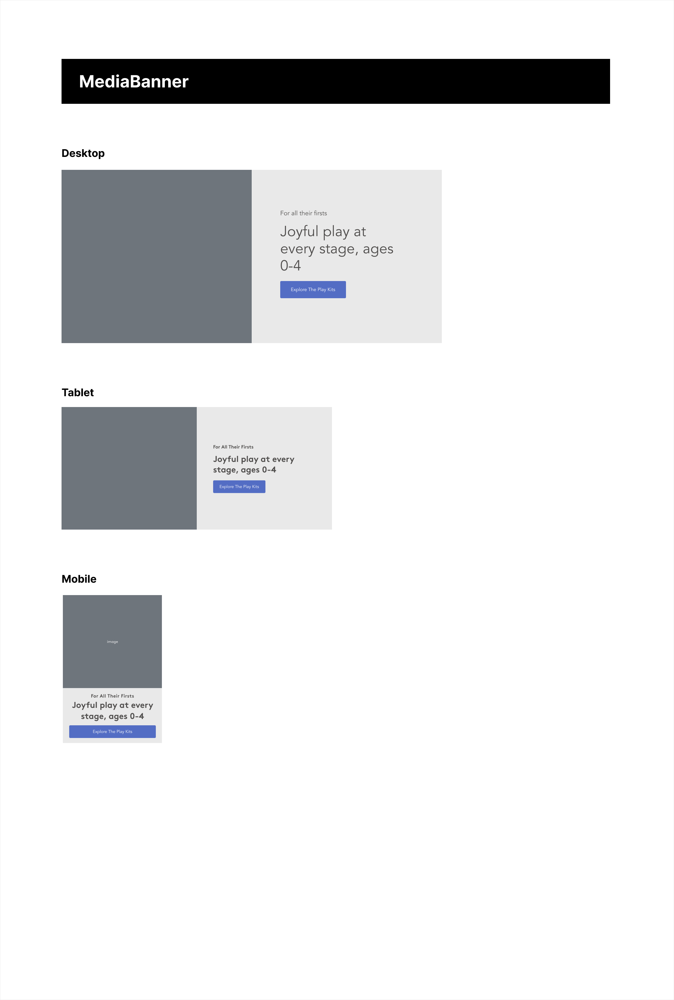
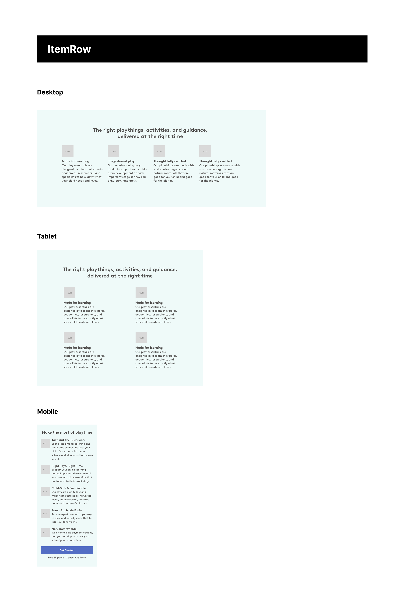

This repository contains the Lovevery Frontend take-home challenge. This activity is open-ended without a right or wrong answer; it's only meant to gauge your approach to frontend problem solving. Relax, take your time, and have fun.

## Setup

This repository contains a Next.js application generated via `create-next-app`.

```bash
$   npm install      # install dependencies
$   npm run dev      # run locally
```

Open [http://localhost:3000](http://localhost:3000) with your browser to see the result.

## Prompt

The goal of this exercise is to build a reusable React component and to place it on a test page. The mockup details two different components to choose from: the MediaBanner and the ItemRow. The mockup provides a general layout, a color palette, and expected behavior on various screen sizes. Your task is to build one of these components in a reusable manner, to leverage the hook at `src/useData`, and to render the component on the page at `src/page`. Please use both TypeScript and Tailwind CSS to build your solution.

## Mockups

<details>
  <summary>MediaBanner</summary>



</details>

<details>
  <summary>ItemRow</summary>



</details>

## Scoring

This activity is intentionally open-ended and aims to gauge your general approach to React development. The following themes will be considered during review:

1. **Technical Expertise**: Showcasing proficiency in React and TypeScript, emphasizing effective code organization and type-safe practices.
1. **Code Quality**: Demonstrating clean, adaptable coding with a robust approach to testing, ensuring efficiency and readability for various data structures.
1. **Problem Solving**: Exhibiting innovative, responsive solutions that effectively function across different devices and screen sizes.
1. **Product Awareness**: Understanding the impact of development decisions on the end-user experience and the overall product.

## Submission

Once you're done, please email us with an archive of your repository. Kindly write a README detailing a description of your solution. This will help us understand your technical approach, design decisions and your ability to effectively communicate and document your work.
